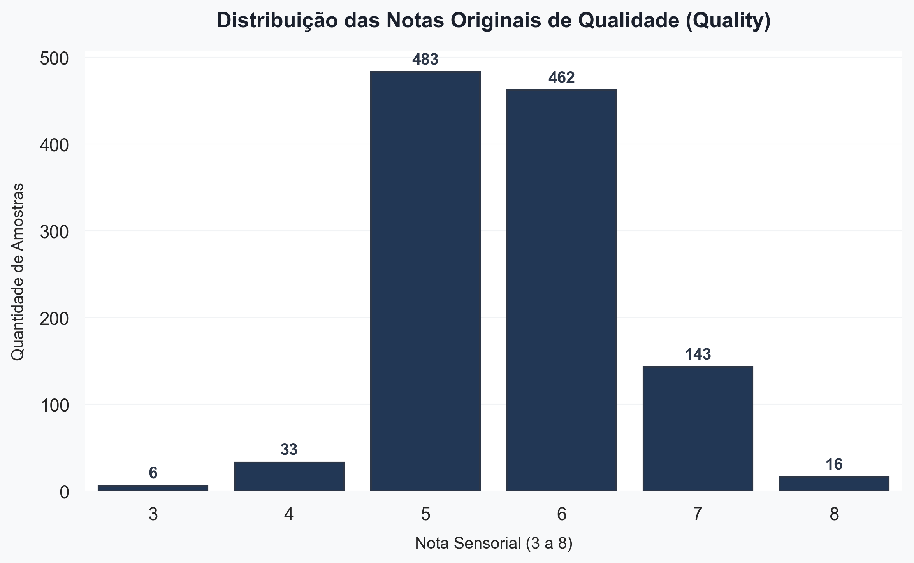
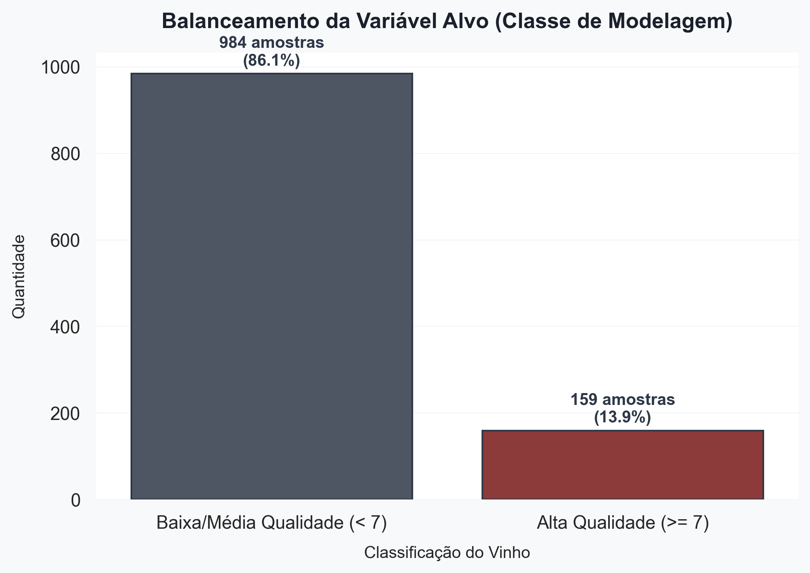
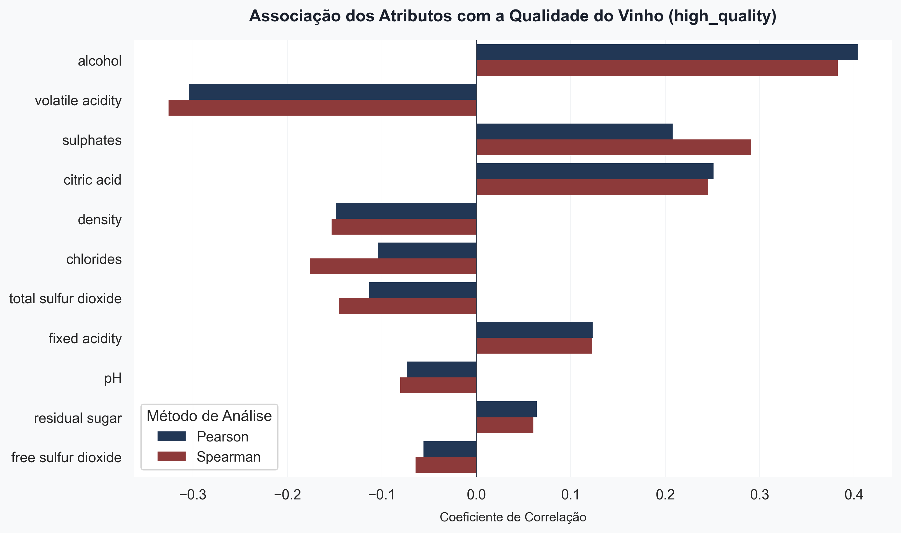
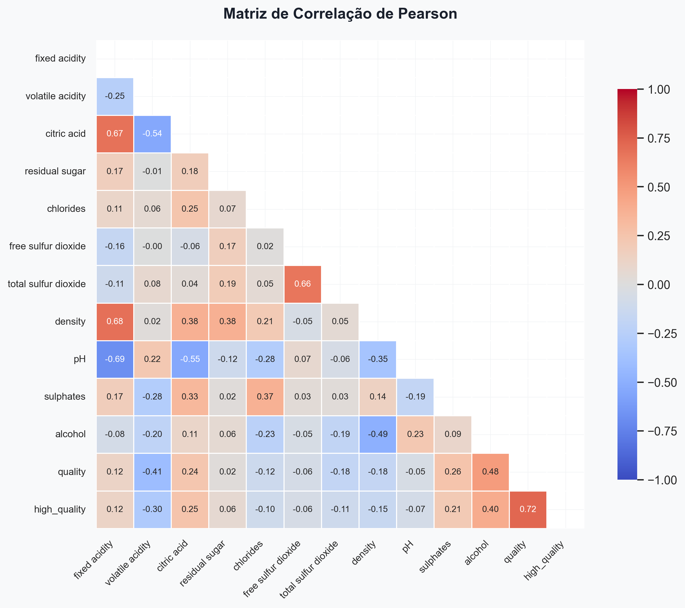
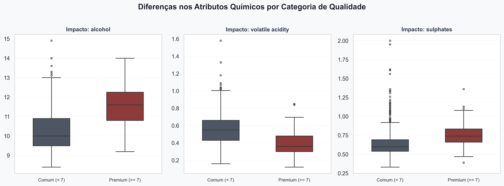
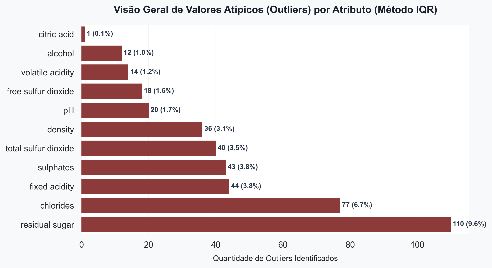

# Relatório de Análise Exploratória de Dados (EDA) - Wine Quality

Este relatório apresenta os achados detalhados obtidos durante a análise exploratória físico-química do Wine Quality Dataset. Todas as conclusões são fundamentadas em estatísticas descritivas, testes de correlação linear (Pearson) e monotônica (Spearman), além de mapeamento formal de outliers.

---

## 1. Leitura Executiva (Insights de Negócio)

> [!NOTE]
> **O que foi observado?**
> A análise estatística identificou que os vinhos classificados como premium (`high_quality = 1`, nota >= 7) apresentam, em média, **teores alcoólicos substancialmente mais elevados** (estando a variável `alcohol` fortemente associada de forma positiva com a qualidade) e **menores concentrações de acidez volátil** (`volatile acidity`, associada de forma negativa). O teor de sulfatos (`sulphates`) também sugere uma tendência positiva moderada de associação com a alta qualidade.
>
> **Por que isso importa para a vinícola?**
> A acidez volátil é gerada principalmente por bactérias acéticas e está associada ao odor de vinagre no vinho. Monitorar ativamente e manter a acidez volátil baixa na produção pode indicar um melhor controle microbiológico e qualidade do produto final. Por outro lado, o teor de álcool e os sulfatos (que agem como antioxidantes e preservativos) indicam que a fermentação e o processo de conservação do vinho são fatores determinantes para a classificação sensorial superior.
>
> **Qual o possível impacto no modelo de Machine Learning?**
> - **Imbalance de Classe**: Apenas 13.91% dos vinhos são de alta qualidade (159 amostras). Modelos preditivos simples focados em acurácia geral serão enviesados e falharão em detectar os vinhos premium. Por isso, a escolha do F1-score e splits estratificados são críticos.
> - **Variáveis Fortes**: Atributos como `alcohol` e `volatile acidity` serão provavelmente as principais features de decisão de modelos como Random Forest ou XGBoost.
> - **Presença de Outliers**: Algumas variáveis (especialmente `residual sugar` e `chlorides`) apresentam percentuais elevados de outliers. Modelos lineares (como Regressão Logística) podem sofrer impacto se esses valores extremos não forem adequadamente tratados, enquanto modelos de árvore (Random Forest) são inerentemente mais robustos a eles.
>
> **Qual decisão de negócio esse insight apoia?**
> 1. **Triagem Rápida na Linha de Produção**: Permite à vinícola rodar análises químicas simples de acidez volátil e teor alcoólico para classificar e separar preventivamente lotes que tenham potencial de ser rotulados como premium, otimizando o estoque físico e direcionando o envelhecimento em barris.
> 2. **Ajuste Fino de Processos**: Apoiar enólogos a ajustarem as etapas de fermentação e a conservação com sulfitos de maneira objetiva.

---

## 2. Visão Geral do Dataset e Estatísticas
O dataset de classificação física do vinho contém:
* **Total de Observações**: 1143 amostras
* **Total de Atributos**: 14 variáveis (incluindo o ID de controle e a coluna alvo criada)
* **Valores Faltantes (Nulls)**: **Nenhum valor nulo** foi encontrado nas variáveis químico-físicas do dataset, o que garante a consistência do pipeline sem necessidade de técnicas de imputação.

### Distribuição das Notas Originais
A avaliação sensorial original varia de 3 a 8. A maior concentração de amostras situa-se nas notas 5 e 6, indicando que a grande maioria da produção possui qualidade intermediária.

### Balanceamento da Variável Alvo (`high_quality`)
Binarizamos a qualidade definindo que notas de 7 a 8 representam a classe positiva (Vinhos de Alta Qualidade). A classe é altamente desbalanceada:
* **Classe 0 (Qualidade Média/Baixa < 7)**: 984 amostras (86.09%)
* **Classe 1 (Alta Qualidade >= 7)**: 159 amostras (13.91%)

---

## 3. Correlações com a Qualidade do Vinho

Avaliamos a relação entre as variáveis através de dois métodos complementares:
1. **Coeficiente de Pearson**: Mede a correlação linear clássica.
2. **Coeficiente de Spearman**: Mede correlações de postos (monotônicas), sendo ideal para dados que não seguem distribuição perfeitamente normal e mitigando o efeito de outliers.

### Principais Associações Identificadas:
* **Teor Alcoólico (`alcohol`)**: Apresenta a relação positiva mais forte com a qualidade (Pearson: **0.404** | Spearman: **0.383**). Isso sugere uma tendência de que vinhos com maior maturação e fermentação completa sejam mais apreciados pelos avaliadores.
* **Acidez Volátil (`volatile acidity`)**: Apresenta a correlação negativa mais acentuada com o alvo (Pearson: **-0.305** | Spearman: **-0.326**). Níveis elevados de acidez volátil podem indicar a presença de defeitos sensoriais associados à oxidação acética.
* **Sulfatos (`sulphates`)**: Mostram uma associação positiva moderada (Pearson: **0.208** | Spearman: **0.291**), reforçando que a preservação e estabilização adequadas do vinho desempenham um papel relevante no produto final.

### Matrizes de Correlação Completas
As matrizes de correlação ilustram também as interações entre as variáveis independentes, o que é fundamental para evitar a multicolinearidade em modelos estatísticos.

| Matriz de Pearson (Linear) | Matriz de Spearman (Monotônica) |
| :---: | :---: |
|  |  |

---

## 4. Análise de Variáveis Chave
Os boxplots abaixo ilustram visualmente a distribuição dos três principais fatores associados com vinhos premium (Classe 1) em comparação com vinhos comuns (Classe 0):

---

## 5. Análise de Outliers e Valores Atípicos
Utilizando a metodologia do Intervalo Interquartil (IQR), mapeamos os valores atípicos que se situam além dos limites calculados:
`[Q1 - 1.5 * IQR, Q3 + 1.5 * IQR]`

### Discussão de Outliers e Impacto:
* **Cloretos (`chlorides`) e Açúcar Residual (`residual sugar`)**: Apresentam taxas muito elevadas de outliers (6.74% e 9.62%, respectivamente). Estes extremos não representam necessariamente dados corrompidos, mas sim variações legítimas de vinificação (ex: vinhos mais doces ou com traços minerais/salinos distintos).
* **Tratamento de Dados**: Para modelos que serão testados a seguir:
  - Modelos Lineares (ex: Regressão Logística) se beneficiarão de transformações de escala robustas (como `RobustScaler`) ou clipping de valores extremos para mitigar o impacto dos outliers.
  - Modelos Baseados em Árvores (ex: Random Forest e XGBoost) lidarão com estes limites de forma natural sem perda de performance.

---

## 6. Conclusões e Próximos Passos
O bootstrap e a análise exploratória comprovam que:
1. Os dados físico-químicos são limpos, consistentes e apresentam fortes correlações com a qualidade percebida.
2. O desbalanceamento de classes é o maior desafio técnico (apenas 13.91% da classe positiva), o que valida nossa estratégia de utilizar splits estratificados e focar na otimização do **F1-Score da Classe 1**.

Com a fundação visual da EDA estruturada e os dados auditados em arquivos CSV na pasta `results/metrics/`, o projeto está perfeitamente pronto para a **Fase 3 (Pré-processamento e Feature Engineering)** e o desenvolvimento de modelos.
